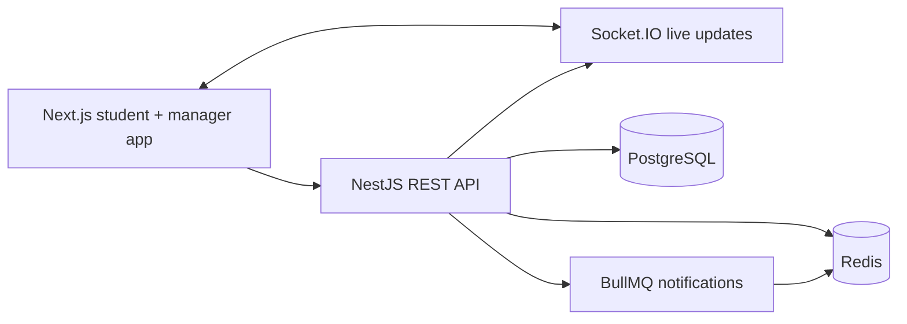

# PLAYGRID

**One Court. 100 Requests. One Winner.**

PLAYGRID is a prototype for contention-safe campus sports facility booking. It focuses on the hard part: when 100 students request the same facility slot at once, exactly one booking succeeds.

## Problem

Ordinary booking apps often do `if available then create booking`, which races under load. PLAYGRID treats PostgreSQL as the source of truth and puts the invariant at the database boundary.

## Architecture



## Concurrency Strategy

Invariant 1: At most one active booking exists for a facility slot.

The `Booking.activeSlotId` column is nullable and unique. Active bookings keep `activeSlotId = slotId`; cancelled historical bookings set it to `null`. The booking engine performs:

```sql
INSERT INTO "Booking" (...)
VALUES (...)
ON CONFLICT ("activeSlotId") DO NOTHING
RETURNING "id";
```

One transaction receives a returned row and responds `201 BOOKING_CONFIRMED`. Every competing transaction receives no row and responds `409 SLOT_ALREADY_BOOKED`.

Redis improves performance and asynchronous processing, but correctness does not depend on Redis. PostgreSQL provides the final booking invariant.

## Idempotency

Every booking request accepts `Idempotency-Key`. The API stores the request hash and original response in `IdempotencyRecord`. Replays with the same key return the original result instead of creating another operation.

Invariant 5: Retrying the same idempotent booking request cannot create another booking.

## Waitlist Promotion

Waitlists are FIFO by default with unique `(userId, slotId)` membership.

Invariant 2: One user cannot appear twice in the same waitlist.

Invariant 3: The active booking holder cannot simultaneously remain `WAITING` in that slot's waitlist.

On cancellation, PLAYGRID transactionally cancels the active booking, selects the next waiting row with `FOR UPDATE SKIP LOCKED`, attempts the same unique booking insert, marks the entry `PROMOTED`, and creates a notification.

Invariant 4: Waitlist promotion cannot create multiple active bookings.

## Tech Stack

- Monorepo: pnpm workspaces
- Frontend: Next.js App Router, TypeScript, Tailwind CSS, shadcn-style UI primitives, Lucide Icons, Framer Motion, Recharts, TanStack Query
- Backend: NestJS, TypeScript, REST, Socket.IO
- Database: PostgreSQL with Prisma
- Queue/cache: Redis and BullMQ
- Testing: Jest, Supertest, Playwright, k6 script
- Infrastructure: Docker Compose

## Local Development - Recommended

On macOS, run only infrastructure in Docker. Next.js and NestJS should run natively on the host filesystem. Docker Desktop bind-mounted filesystem performance can make Next.js development compilation dramatically slower, especially on route-heavy apps.

```bash
pnpm infra:up
pnpm install
pnpm db:migrate
pnpm db:seed
pnpm dev
```

Web: http://localhost:3000

API: http://localhost:4000/health

PostgreSQL for this Mac is exposed on host port `15432` because local macOS Postgres is already using `5432`. The database still runs inside Docker as `playgrid-postgres`.

Redis: `localhost:6379`

Next.js dev uses Turbopack:

```bash
pnpm dev:web
pnpm dev:api
```

`pnpm dev` runs both native dev servers concurrently.

## Full Docker - Deployment / Reproducibility

The checked-in Compose files intentionally run infrastructure only for local development. If production Dockerfiles are added later, keep them separate from the macOS development path so app source and `.next` are not bind-mounted through Docker Desktop.

Infrastructure only:

```bash
docker compose -f docker-compose.infra.yml up -d postgres redis
docker compose -f docker-compose.infra.yml down
```

If Prisma reports a permission error while touching its engine cache, the project scripts already force Prisma to use the repo-local `.cache` directory. Run the command through pnpm, not a global Prisma binary:

```bash
pnpm db:migrate
```

## Demo Credentials

Password for all demo accounts: `PlayGrid123!`

- Student: `student@playgrid.demo`
- Manager: `manager@playgrid.demo`
- Admin: `admin@playgrid.demo`

## Test Commands

```bash
pnpm test
pnpm test:integration
pnpm test:e2e
pnpm test:race
```

k6 load script:

```bash
k6 run tests/load/booking-race.js \
  -e BASE_URL=http://localhost:4000 \
  -e TOKEN=<jwt> \
  -e SLOT_ID=<facility-slot-id>
```

## Race Demo

1. Sign in as `student@playgrid.demo`.
2. Open `/facilities` and view Badminton Court 1.
3. Open `/demo/race`.
4. Select Badminton Court 1, a 6 PM slot, and `100 concurrent requests`.
5. Click **Run race**.

Expected result:

- Requests: 100
- Successful bookings: 1
- Rejected conflicts: 99
- Database bookings: 1
- Integrity: PASSED

## API Overview

- `POST /auth/login`
- `GET /auth/me`
- `GET /facilities`
- `GET /facilities/:id`
- `GET /facilities/:id/slots`
- `POST /bookings`
- `GET /bookings/me`
- `DELETE /bookings/:id`
- `POST /slots/:id/waitlist`
- `GET /waitlist/me`
- `GET /alternatives/:slotId`
- `GET /notifications`
- `GET /manager/dashboard`
- `GET /manager/analytics`
- `POST /manager/maintenance`
- `PATCH /manager/facilities/:id`
- `POST /demo/race`

## Screenshots

After running locally, capture:

- Landing dashboard with ClashProof visual
- Facility slot picker
- Race demo passed state
- Manager analytics dashboard
